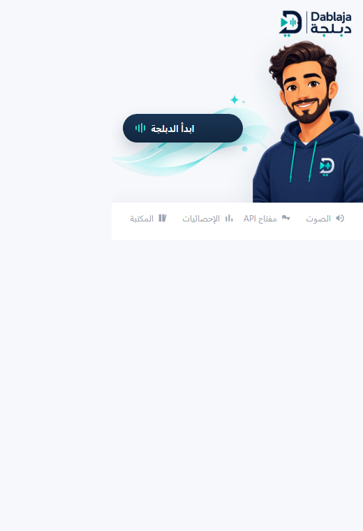
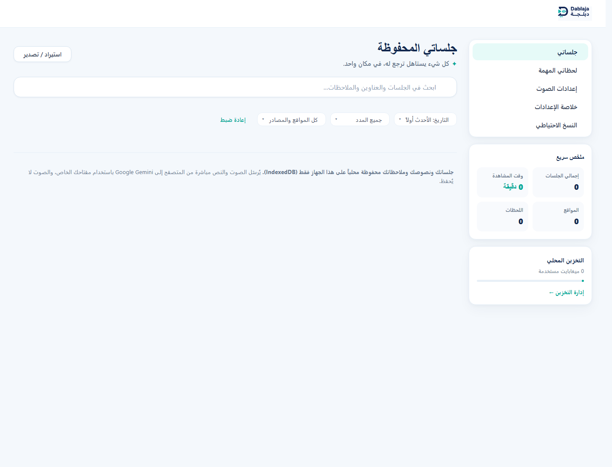

# dablaja — live Arabic dubbing for any tab

> **افهم الفيديوهات والدورات والندوات الإنجليزية مباشرةً بالعربية، بصوت عربي وترجمة ثنائية مباشرة.**

dablaja is a Manifest V3 Chrome extension that captures the **audio** of the active tab after an explicit click, streams it to Google's [Gemini Live Translate API](https://ai.google.dev/gemini-api/docs/live-api/live-translate) using **your own API key**, and plays the Arabic translation back over the original. Bilingual transcripts of each session can be kept in a local, searchable library.

There is no backend. Audio and text go straight from your browser to Google and nowhere else; everything the extension saves stays on your device.

> **Status:** dablaja was previously published on the Chrome Web Store and has since been withdrawn. It is now published as open source as-is. It works unpacked, but it depends on a **preview** Gemini model whose availability, pricing and behavior Google may change at any time.

## Screenshots

### Toolbar popup

Start live dubbing from the current audible tab, then open the audio, API-key, statistics or library views from the same compact popup.



### Local session library

Saved transcripts, bookmarks, notes, search, site-specific sound profiles, usage summaries and exports remain on the device.



## Features

- One-click live dubbing of any ordinary HTTPS tab (YouTube, courses, webinars, podcasts…).
- Independent volume for original and dubbed audio, with optional automatic ducking of the original while Arabic speech plays.
- Arabic (RTL) and English UI.
- Local session library (IndexedDB): bilingual transcripts, notes, timestamped bookmarks, full-text search, and YouTube thumbnails.
- Exports: plain text, bilingual SRT, print/PDF and JSON, plus full local backup and validated import.
- Optional per-site volume profiles.
- Local usage statistics page (never uploaded).

Library limits: up to 500 saved sessions, 100 bookmarks per session and 50 site profiles.

## Install (unpacked)

1. Clone or download this repository.
2. Open `chrome://extensions` in Chrome 116 or newer.
3. Turn on **Developer mode**.
4. Click **Load unpacked** and select the repository folder (the one containing `manifest.json`).
5. Pin **dablaja** if you like.

## Use

1. Create a Gemini API key in [Google AI Studio](https://aistudio.google.com/apikey). Prefer a dedicated key for this extension.
2. Open an audible HTTPS tab, open the extension popup, paste the key into the masked field and save it. **Never paste your key into chat, a terminal command or a bug report.**
3. Click **ابدأ الدبلجة** (Start dubbing). Tab capture begins only from this click.
4. Adjust original and dubbed volume from the audio sheet.
5. Click **إيقاف الدبلجة** (Stop dubbing). If local saving is on, the session appears in the library.
6. Delete the key from the popup when you no longer need it.

## Architecture

```text
Popup click
  → MV3 service worker (active tab, state, one-time stream ID)
  → offscreen document (tab MediaStream + AudioContext graph)
      ├─ original GainNode → speakers
      ├─ capture AudioWorklet → mono PCM16/16 kHz/100 ms → Gemini WSS
      └─ playback AudioWorklet ← PCM16/24 kHz ← Gemini → dubbed GainNode → speakers
  → local library (IndexedDB session records)
```

| Path | Role |
| --- | --- |
| `src/service-worker.js` | Session lifecycle, settings, message routing, library persistence |
| `src/offscreen/` | Audio graph and Gemini WebSocket session |
| `src/worklets/` | Capture (downmix/resample/encode) and playback (decode/resample/buffer) worklets |
| `src/popup/` | Toolbar popup: start/stop, key, volumes |
| `src/library/` | Session library, exports, backup/import, settings |
| `src/stats/` | Local usage statistics |
| `src/diagnostics/` | Local diagnostics page for testing capture on the previous tab |
| `src/shared/` | Pure modules shared by the above (protocol, audio utils, session model, IndexedDB, search, export) |

The playback worklet resamples 24 kHz output to the device `AudioContext` rate, adapts its prebuffer between 280–520 ms, and absorbs short network jitter as silence instead of stopping and rebuffering. It caps queued audio at 2.5 seconds and drops stale backlog to roughly 1.2 seconds if it grows too large. It fades in after a real gap, limits peaks, and can smoothly duck original audio while Arabic speech plays. The capture path keeps sending through short pauses, then sends `audioStreamEnd` after two seconds of silence and retains 300 ms of in-memory pre-roll.

Some on-disk names (`plus*` storage keys, the `dablaja-plus` IndexedDB database and backup `kind` strings) date from an earlier paid tier and are kept so existing local data continues to load.

## Gemini API contract (verified 2026-08-25)

The implementation follows Google's official [Live translation guide](https://ai.google.dev/gemini-api/docs/live-api/live-translate):

- Model: `gemini-3.5-live-translate-preview` (preview)
- Endpoint: `wss://generativelanguage.googleapis.com/ws/google.ai.generativelanguage.v1beta.GenerativeService.BidiGenerateContent`
- Input: mono raw PCM16 little-endian, 16 kHz, 100 ms (1,600-sample) chunks
- Output: mono raw PCM16 little-endian, 24 kHz
- Target language: `ar`
- Input and output transcription enabled
- `echoTargetLanguage: false`
- Context-window compression enabled; `GoAway` triggers a safe reconnect into a fresh translation session

The extension intentionally does not configure Gemini session resumption. Google documents that a resumption handle can retain live conversation state, including audio and text, for up to 24 hours, so reconnects start a fresh translation session instead.

Protocol note: Google's Live Translate page shows transcription objects nested in `generationConfig`, while the official `@google/genai` serializer emits `inputAudioTranscription` and `outputAudioTranscription` directly under `setup`. Live testing rejected the nested shape with WebSocket code 1007. The extension therefore starts with the root-level shape and performs one bounded 1007 compatibility retry with the documented nested shape; it never loops between layouts.

Cost: Live Translate usage is billed to **your** key. Check Google's current [Gemini API pricing](https://ai.google.dev/gemini-api/docs/pricing). Free-tier usage may be used to improve Google's products; see the [data-use guidance](https://ai.google.dev/gemini-api/docs/zdr).

## Security and privacy model

- The API key is stored only in `chrome.storage.local` (never sync storage) and is revealed only when you press the show/change control.
- Tab audio and transcripts are sent **only** to Google Gemini, during a session you start. Google processes them under the Gemini API terms and the data-use rules of the billing tier attached to your key.
- The extension never stores audio. Transcripts, titles and URLs you save stay in local IndexedDB. Local saving can be turned off in the library settings without affecting live dubbing.
- While a session runs with local saving on, a bounded recovery snapshot lives in `chrome.storage.session` so a service-worker restart doesn't lose the transcript; it is finalized into the library on Stop.
- Opening the library can load a saved YouTube video's thumbnail from `i.ytimg.com` with `Referrer-Policy: no-referrer`. Google/YouTube still receives the video ID and ordinary network metadata such as your IP address.
- Permissions are limited to `activeTab`, `tabCapture`, `storage` and `offscreen`, plus host access to `generativelanguage.googleapis.com`. No content scripts, ads, analytics, telemetry or browsing-history access.
- No runtime dependencies, remote code, `eval` or inline scripts. Logs never include keys, URLs, audio or transcripts.

**BYOK trade-off:** Google recommends ephemeral tokens for client-to-server Live API apps, but those require a provisioning backend. This extension deliberately has none, so the API key must live on your device and is placed in the WebSocket URL as Google's raw WebSocket protocol requires. Use a dedicated, restricted key and delete it from the extension when you don't need it.

See [PRIVACY.md](PRIVACY.md) for the full privacy notice.

## License

[MIT](LICENSE) — copyright © 2026 Yazan Baker.

## Development

Requires Node.js 20+. Dev dependencies (ESLint, Puppeteer) are only used for checks; the extension itself has no dependencies or build step.

```bash
npm install
npm run verify   # unit tests + static checks + ESLint + manifest validation
```

Other scripts:

- `npm run smoke`: headless browser smoke test of the unpacked extension (needs a local Chrome/Edge).
- `npm run e2e`: end-to-end suite driving the real unpacked extension.
- `scripts/generate-icons.ps1`: regenerates the toolbar icons from `assets/logo toolbar.png` (or `assets/logo.png`).

## Known constraints

- The preview model's availability, geography, quota, pricing and behavior are controlled by Google.
- The latency badge measures detected source activity to the first returned audio. It is approximate, not an end-to-end guarantee.
- Silence gating uses an energy threshold and may treat quiet speech as a pause or music as activity.
- Automated checks cannot judge audio quality. A human must confirm audibility, balance, delay and the absence of crackling or overlap.
- Chrome internal pages, the Chrome Web Store, DRM-restricted media and tabs without audible audio may not be capturable.
